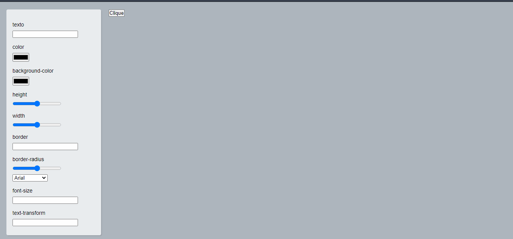

<h1 align="center"> Button-creator </h1>

 Aplicação web onde você pode modificar as propriedades css
do botão. 

<h2 align="center"> Sobre o projeto </h2>

Projeto criado utilizando HTML, CSS e Javascript.

 O layout foi construído utilizando flexbox garantindo a responsividade. 

 O javascript foi responsável por:
<ul>
<li>Pegar os valores das propriedades css</li>
<li>Passar os valores para o botão fazendo assim a modificação do mesmo</li>
<li>Salvar os valores no localStorage do navegador</li>
<li>Recuperar os valores salvos e setar nas propriedades </li>
</ul>

 

<h2> Autor </h2>

 Hamilton de Souza 

